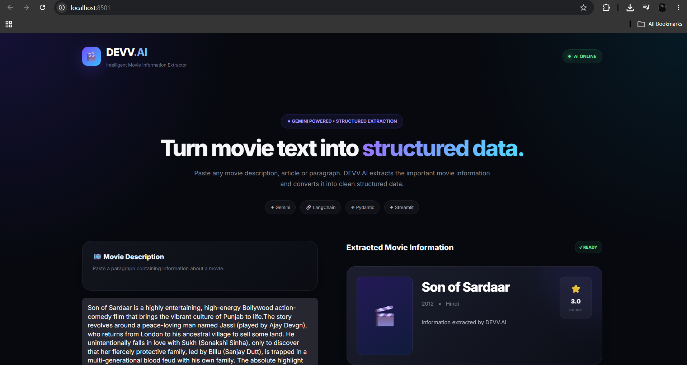

# 🎬 MovieInfo.AI

> Transform unstructured movie text into clean, structured movie information using Generative AI.

MovieInfo.AI is an AI-powered movie information extraction application built with **Google Gemini, LangChain, Pydantic and Streamlit**.

Simply provide a movie description or paragraph and the application automatically extracts structured information such as:

- 🎬 Movie Title
- 📅 Release Year
- 🎭 Genre
- 🎥 Director
- 👥 Cast
- ⭐ Rating
- 📝 Summary


## 🚀 Project Preview




## ✨ Features

- 🤖 Powered by Google Gemini
- 🔗 LangChain prompt orchestration
- 🧩 Pydantic structured output
- 🎯 Automatic movie information extraction
- 🖥️ Modern Streamlit interface
- 📦 Clean JSON-compatible output
- ⚡ Simple and fast workflow
- 🔐 Environment variable based API configuration


## 🧠 How It Works

```text
User Movie Paragraph
        │
        ▼
   ChatPromptTemplate
        │
        ▼
    Google Gemini
        │
        ▼
   Raw AI Response
        │
        ▼
 PydanticOutputParser
        │
        ▼
   Movie Data Model
        │
        ▼
 Structured Movie Information
